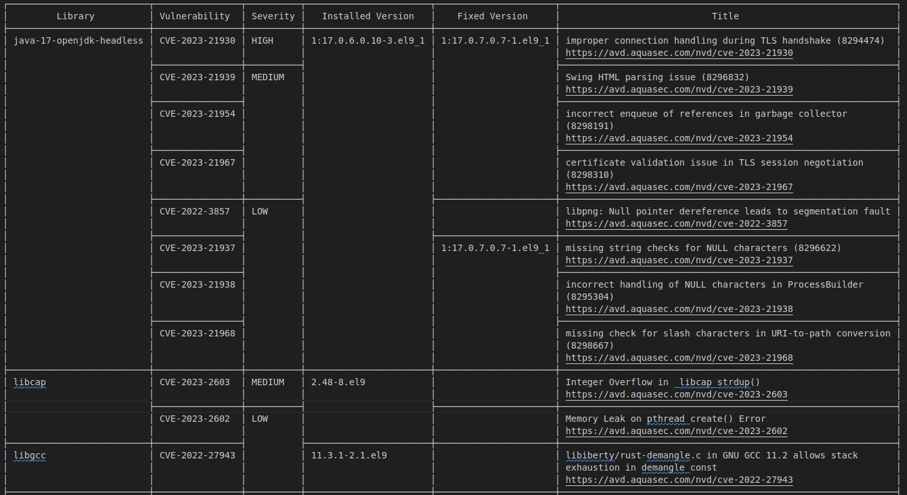

# M1877 - Seguridad en Cloud Computing.
# José Enrique Rodríguez González.
# PEC3: Gobierno de las aplicaciones Cloud y modelos DevSecOps

## Indice

- [Presentación.](#presentación)
- [Pregunta 1.](#pregunta-1)
- [Pregunta 2.](#pregunta-2)
- [Pregunta 3.](#pregunta-3)
- [Despliegue.](#despliegue)
  - [Instalación de Docker en la VM.](#instalación-de-docker-en-la-máquina-virtual)
  - [Despliegue del Docker de Keycloak.](#despliegue-del-docker-de-keycloak)
- [Respuesta a la pregunta 1.1.](#respuesta-a-la-pregunta-11)
- [Respuesta a la pregunta 1.2.](#respuesta-a-la-pregunta-12)
- [Respuesta a la pregunta 1.3.](#respuesta-a-la-pregunta-13)
- [Respuesta a la pregunta 1.4.](#respuesta-a-la-pregunta-14)
- [Respuesta a la pregunta 1.5.](#respuesta-a-la-pregunta-15)
- [Respuesta a la pregunta 1.6.](#respuesta-a-la-pregunta-16)
- [Respuesta a la pregunta 1.7.](#respuesta-a-la-pregunta-17)
- [Respuesta a la pregunta 1.8.](#respuesta-a-la-pregunta-18)
- [Respuesta a la pregunta 2.1.](#respuesta-a-la-pregunta-21)
- [Respuesta a la pregunta 2.2.](#respuesta-a-la-pregunta-22)
- [Respuesta a la pregunta 3.1.](#respuesta-a-la-pregunta-31)
- [Respuesta a la pregunta 3.2.](#respuesta-a-la-pregunta-32)
- [Respuesta a la pregunta 3.3.](#respuesta-a-la-pregunta-33)

---

## Presentación

Esta tercera PEC os permitirá identificar y conocer los procesos, arquitecturas y herramientas alrededor de la gestión de la identidad digital en un entorno de responsabilidad compartida, y por otro lado se hará una introducción a los fundamentos de la cultura DevOps y DevSecOps haciendo hincapié en la importancia de incorporar seguridad al ciclo de desarrollo del software desde el inicio en entornos multicloud.

Para cualquier duda y/o aclaración sobre el enunciado, debéis dirigiros al consultor responsable de vuestra aula.

[Volver al índice.](#indice)

---

 

##  Pregunta 1.

La PEC anterior os permitió resolver que vuestra oficina principal y una de vuestras sucursales de vuestra organización migradas a la nube pública de Amazon Web Services estuvieran bajo una conexión VPN segura entre los dos lugares (Site-to-Site) permitiendo a los servidores de las sucursales se conectaran a los datos almacenadas al VPC de la oficina principal a la nube AWS.

En este caso iremos más allá respecto a la gestión de la identidad digital de vuestra organización, consolidando procesos y credenciales de una manera centralizada. El objetivo es desplegar vuestro propio proveedor de identidad (IdP) con capacidades de interoperabilidad y hacer una integración de un proveedor de servicio (SP) de ejemplo.

Para este ejercicio la solución de IdP que  tenéis que desplegar es Keycloak (https://www.keycloak.org).

Keycloak: Open Source Identity and Access Management

- Add authentication to applications and secure services with minimum effort.
- No need to deal with storing users or authenticating users.
- Keycloak provides user federation, strong authentication, user management, fine-grained authorization, and more.

Para realizar el ejercicio disponéis de dos opciones para el despliegue: (a escoger):

1. Utilizar un virtualizador local como VirtualBox o soluciones similares de gestión de VM's locales sobre infraestructura propia del alumno fuera del Cloud Público. (Simulando un CPD propio o servicio de cloud privado).
2. Usad el laboratorio de la UOC en AWS donde aprovisionar un nuevo entorno que hospede el proveedor de identidad (IdP) dentro de una nueva instancia.

Para desplegar keycloak seguid la siguiente guía un vez hayáis montado la MV o la instancia EC2:

Pasos para instalar docker

~~~
sudo apt install apt-transport-https curl gnupg-agent ca-certificates software-properties-common -y

sudo install -m 0755 -d /etc/apt/keyrings
curl -fsSL https://download.docker.com/linux/ubuntu/gpg | sudo gpg --dearmor -o /etc/apt/keyrings/docker.gpg

sudo chmod a+r /etc/apt/keyrings/docker.gpg

echo \
"deb [arch="$(dpkg --print-architecture)" signed-by=/etc/apt/keyrings/docker.gpg] https://download.docker.com/linux/ubuntu \
"$(. /etc/os-release && echo "$VERSION_CODENAME")" stable" | \
sudo tee /etc/apt/sources.list.d/docker.list > /dev/null

sudo apt-get update

sudo apt-get install docker-ce docker-ce-cli containerd.io

docker-buildx-plugin docker-compose-plugin

openssl req -newkey rsa:2048 -nodes -keyout server.key.pem -x509 -days 365 -out server.crt.pem

chmod 755 server.key.pem

docker run --name keycloak -e KEYCLOAK_ADMIN=admin -e
KEYCLOAK_ADMIN_PASSWORD=admin -e
KC_HTTPS_CERTIFICATE_FILE=/opt/keycloak/conf/server.crt.pem -e
KC_HTTPS_CERTIFICATE_KEY_FILE=/opt/keycloak/conf/server.key.pem -v
$PWD/server.crt.pem:/opt/keycloak/conf/server.crt.pem -v
$PWD/server.key.pem:/opt/keycloak/conf/server.key.pem -p 8443:8443
quay.io/keycloak/keycloak:21.1.0 start-dev

~~~

Una vez hayáis seguido estos pasos deberías tener el keycloak escuchando en https://IP_EC2:8443 o https://IP_VM:8443 dependiendo de si habéis usado AWS o  VirtualBox para desplegar el entorno.

Para facilitaros la configuración de Keycloak os recomendamos utilizar el siguiente tutorial oficial https://www.keycloak.org/getting-started/getting-started-docker, el cual os guiará con los principales pasos que tenéis que ir realizando hasta llegar a integrar una aplicación de test con OpenID que dispone en línea el proyecto Keycloak para validar su correcto funcionamiento.

**IMPORTANTE: Cómo podréis comprobar, el tutorial recomendado utiliza una imagen de Docker, este hecho impacta en el tipo de AMI (Ubuntu 22.04) que utilizaréis en el caso de AWS y las capacidades/funcionalidades de la MV en el caso de ir con un virtualizador local como VirtualBox (Por ejemplo Ubuntu Server 22.04 + Docker Engine) para cumplir los requisitos previos.**

Una vez finalizado con el despliegue y la integración de la aplicación de ejemplo, contestar a las siguientes preguntas:
1. Elaborar un informe con el procedimiento seguido para llevar a cabo el despliegue del IdP con los correspondientes pantallazos para cada uno de los  pasos y donde se verifique el correcto funcionamiento de la integración de la aplicación (SP) de test.
2. Explica cuál es la ventaja de utilizar la funcionalidad de "realms" a Keycloak y pon un ejemplo de uso en una organización que tiene como negocio desarrollar y dar servicio a un servicio de CRM en modo SaaS.
3. Detalla las diferencias en el ámbito funcional al usar el protocolo OAuth 2.0 o SAML 2.0 en una integración de un proveedor de servicio o aplicación de tipo web.
4. Qué servicios de AWS podemos usar para dotar de alta disponibilidad a nuestro servicio de proveedor de identidad basado en Keycloak?
5. Enumera y justifica cuál sería la alternativa para construir un IdP de acuerdo con el uso de alguno de los servicios ofrecidos directamente por AWS dentro de su catálogo.
6. Detalla cuáles serían las ventajas y las desventajas de desplegar una solución como Keycloak sobre EC2 de AWS frente un Cloud Privado fuera de un servicio de infraestructura de Cloud público.
7. Identifica y describe las principales amenazas sobre sistemas de información que ofrecen servicios de identidad desplegados en entornos de cloud público.
8. Selecciona tres de las amenazas identificadas en el punto anterior, las que consideres más importantes, y describe una aproximación sobre su posible mitigación.

[Volver al índice.](#indice)

---

               

## Pregunta 2.

**DevSecOps Pipeline**

DevOps es un conjunto de prácticas, herramientas y filosofía cultural que sirve para automatizar e integrar los procesos que comparten el equipo de desarrollo de software y el de TI u operaciones.

Dentro del proceso de transformación digital, vuestra organización propone que el equipo de seguridad se integre también dentro del ciclo de desarrollo del software (SDLC). Suponiendo que las etapas que integran el SDLC actualmente son las que aparecen en la Fig. 1.

1. Proponer y describir en detalle qué etapas añadirías para garantizar la seguridad del pipeline de DevOps. Pon un ejemplo concreto de alguna herramienta que podrías utilizar en cada una de las etapas.

2. Seleccionar una nube pública (AWS, Azure, GCP, etc..) y analizar cómo se podría implementar el nuevo pipeline con las etapas de seguridad propuestas en base a los servicios disponibles actualmente en el cloud provider elegido.

[Volver al índice.](#indice)

---

            

## Pregunta 3.

**Escaneo de imágenes**

La adopción de metodologías DevOps habitualmente va asociada al uso de contenedores de Docker, para agilizar los despliegues y la portabilidad de las aplicaciones entre los diferentes entornos, esto hace que una de las principales preocupaciones sea identificar posibles vulnerabilidades en las imágenes de estos contenedores, dado que es común que se extraigan de repositorios públicos como DockerHub (https://hub.docker.com/). Para mitigar este riesgo, en este ejercicio, se propone analizar el uso del escáner de vulnerabilidades: *trivy*
(https://github.com/aquasecurity/trivy)

1. Describe brevemente las principales funcionalidades de la herramienta e indica los pasos necesarios para instalar la herramienta.
2. Una vez tengáis la herramienta disponible, indicar con qué comando podemos analizar las vulnerabilidades de una imagen de Docker. Poner un ejemplo con una imagen concreta, podéis utilizar la imagen docker de keycloak de la pregunta 1.
3. Aparte de analizar las vulnerabilidades de una imagen de Docker, ¿qué otros aspectos relacionados con la seguridad deberíamos tener en cuenta a la hora de trabajar con aplicaciones en contenedores?

**NOTA: Para realizar este ejercicio podéis utilizar la misma MV o máquina EC2 creada en la Pregunta 1 donde ya tendréis instalado Docker.**

[Volver al índice.](#indice)

---

                       

## Despliegue.

En este caso procederé a usar una VM de Ubuntu sobre VirtualBox. Para ello y tal como indica el manual, se procede a realizar dos procesos. El primero consistirá en la [instalación de docker](#instalación-de-docker-en-la-máquina-virtual) siguiendo el manual, y el segundo paso, será el [despliegue del docker de keycloak](#despliegue-del-docker-de-keycloak) en la máquina virtual.

---

### Instalación de Docker en la máquina virtual.

Se procede a ejecutar el siguiente comando para instalar las dependencias necesarias:

~~~
sudo apt install apt-transport-https curl gnupg-agent ca-certificates software-properties-common -y
~~~

A continuación, creamos el directorio  `/etc/apt/keyrings` con el siguiente comando:

~~~
sudo install -m 0755 -d /etc/apt/keyrings
~~~

Ahora, se procede a descargar y agregar clave GPG de Docker al `keyring` de apt con el siguiente comando:

~~~
curl -fsSL https://download.docker.com/linux/ubuntu/gpg | sudo gpg --dearmor -o /etc/apt/keyrings/docker.gpg

sudo chmod a+r /etc/apt/keyrings/docker.gpg
~~~

Añadiremos el repositorio de Docker a la lista de fuentes de paquetes de apt ejecutando el siguiente comando:

~~~
echo "deb [arch=$(dpkg --print-architecture) signed-by=/etc/apt/keyrings/docker.gpg] https://download.docker.com/linux/ubuntu $(. /etc/os-release && echo "$VERSION_CODENAME") stable" | sudo tee /etc/apt/sources.list.d/docker.list > /dev/null
~~~

Actualizamos la lista de paquetes disponibles el el repositorio de apt.

~~~
sudo apt-get update
~~~

Instalaremos Docker, Docker CLI y containerd.io con el siguiente comando:

~~~
sudo apt-get install docker-ce docker-ce-cli containerd.io
~~~

Se procede a instalar los complementos docker-buildx-plugin y docker-compose-plugin usando el el siguiente comando:

~~~
sudo apt-get install docker-buildx-plugin docker-compose-plugin
~~~

A continuación procedemos a desplegar el contenedor de keycloak.

---

### Despliegue del Docker de Keycloak.

El primer paso para el despliegue será generar un par de claves privada y pública para configurar el certificado HTTPS. Para ello, ejecutaremos el siguiente comando en la terminal:

~~~
openssl req -newkey rsa:2048 -nodes -keyout server.key.pem -x509 -days 365 -out server.crt.pem
~~~

Procederemos ademas a rellenar información del certificado, esta vez de manera aleatoria.

En este momento, ya hemos generado una archivo de clave privada y un certificado público. Lod cuales son `server.key.pem` y `server.crt.pem` respectivamente.

Ahora, asignaremos permisos a server key pem del tipo `rwxr-xr-x` (solo el usuario propietario del archivo podrá escribir sobre él). Para ello ejecutamos el siguiente comando

~~~
chmod 755 server.key.pem
~~~

Lo siguiente a realizar es iniciar el docker de keycloak usando las claves y configuraciones proporcionadas por el enunciado de la presente PEC.

Para ello ejecutaremos el siguiente comando:

~~~
sudo docker run --name keycloak -e KEYCLOAK_ADMIN=admin -e KEYCLOAK_ADMIN_PASSWORD=admin -e KC_HTTPS_CERTIFICATE_FILE=/opt/keycloak/conf/server.crt.pem -e KC_HTTPS_CERTIFICATE_KEY_FILE=/opt/keycloak/conf/server.key.pem -v $PWD/server.crt.pem:/opt/keycloak/conf/server.crt.pem -v $PWD/server.key.pem:/opt/keycloak/conf/server.key.pem -p 8443:8443 quay.io/keycloak/keycloak:21.1.0 start-dev
~~~

Este comando deja configurado el contenedor de la siguiente manera:

- El nombre del contenedor:
  - `keycloak`.
- Credenciales de usuario administrados:
  - Usuario `KEYCLOAK_ADMIN`:
    - `admin`.
  - Contraseña `KEYCLOAK_ADMIN_PASSWORD`:
    - `admin`.
- Se especificarán los archivos de certificado:
  - `server.crt.pem` 
  - Clave privada:
    - `server.key.pem`
- Puerto de ataque:
  - 8443
- Imagen de Keycloak:
  - `quay.io/keycloak/keycloak:21.1.0`.

En la siguiente imagen, se puede ver, en consola que el docker de keycloak se ha levantado correctamente en modo desarrollo, nos advierte que no lo usemos en modo producción.

A continuación se procederá a acceder al docker a través del navegador web, usando la URL `https://localhost:8443`, nos aparecerá la siguiente advertencia, pulsamos en avanzado y aceptamos el riesgo1.

                

> 1. Aceptamos el riesgo porque nosotros mismos hemos configurado el servidor keycloak en el puerto 8443.

A continuación, para poder conectarnos a la dirección IP de la máquina virtual, ejecutaremos el comando `ip address` para saber cual es la dirección IP y poder acceder desde el host huésped al servidor keycloak instalado en la VM.

Como se indica en la consola, Se observa que la dirección IP es `192.168.0.18`

[Volver al índice.](#indice)

---

                       

## Respuesta a la pregunta 1.1.

Se puede considerar que el [despliegue del docker de Keycloak](#despliegue-del-docker-de-keycloak) forma parte de esta respuesta, motivo por la cual ha quedado enlazado. Por lo que continuamos con el procedimiento.

A continuación, procedemos a introducir las credenciales de administración, anteriormente indicadas.

- Procedemos a crear un Realm, para ello hacemos clic en el menú desplegable del encabezado izquierdo clic en "Add realm" para crear un nuevo Realm.
- En la página de creación de Realm, introducimos un nombre descriptivo para el nuevo Realm en el campo "Name".
Haremos clic en el botón "Create" para crear el nuevo Realm.

Podemos observar que el Realm ha sido creado, ahora procederemos a configurar el cliente.

- Comprobaremos que tenemos el realm cloud seleccionado.

- En el menú del encabezado izquierdo, hacer click en "Clients" para acceder a la sección de configuración de los clientes en el Realm.
  - Hacemos click en el botón "Create" para crear un nuevo Cliente.

Procedemos a crear un role, en este caso acceso a administración.

A continuación, nos aseguraremos de configurar correctamente otras opciones relevantes según las necesidades en la configuración del Realm y del Cliente. Algunas opciones comunes incluyen:

- Configuración de flujos de autenticación (como OpenID Connect, SAML, etc.).

- Configuración de roles y permisos.

- Configuración de proveedores de identidad externos.

- Configuración de políticas de seguridad.

- Configuración de temas y apariencia.

A continuación se procedería a la configuración de la aplicación SP:

- Configurar los ajustes en la aplicación SP para la integración con keycloak
- Proporcionar detalles de configuración como la URL del IdP, realm, cliente ID y demás configuraciones requeridas.

Por ultimo haremos pruebas de integración.

- Acceso correcto de la aplicación SP en el navegador web usando la URL correspondiente.
- Verificar que la aplicación redirige correctamente a IdP para la autenticación.
- Inicio de sesión en keycloak usando credenciales válidas y se comprueban que la autenticación sea exitosa.
- Verificar que la aplicación SP recibe los datos del usuario adecuado después de la autenticación.
- Realizar pruebas adicionales para asegurarse de que la integración entre IdP y aplicación SP funciona correctamente.

[Volver al índice.](#indice)

---

  

## Respuesta a la pregunta 1.2.

La ventaja de utilizar la funcionalidad de "realms" en Keycloak radica en la capacidad de crear y administrar espacios aislados y seguros para diferentes aplicaciones, usuarios y grupos dentro de una sola instancia de Keycloak. Cada "realm" es una partición independiente con su propio conjunto de configuraciones, usuarios, roles y políticas de seguridad. Esto ofrece flexibilidad y control para administrar múltiples entornos de autenticación y autorización en una organización.

En el contexto de una organización que desarrolla y ofrece un servicio de Customer Relationship Management (CRM) en modo SaaS (Software as a Service), se pueden aprovechar las "realms" de Keycloak de la siguiente manera:

- Aislamiento y Seguridad: La organización puede crear un "realm" separado para cada uno de sus clientes en el servicio de CRM. Cada "realm" tendría su propia configuración de seguridad, roles y políticas de acceso. Esto permite un aislamiento adecuado entre los datos y usuarios de cada cliente, garantizando su privacidad y seguridad.

- Gestión de Usuarios y Roles: Dentro de cada "realm", la organización puede definir usuarios y roles específicos para cada cliente de CRM. Por ejemplo, se pueden crear roles de administrador, usuarios internos y usuarios externos para cada cliente. Esto facilita la gestión y administración de usuarios y sus permisos, asegurando que cada cliente tenga control total sobre su propia base de usuarios.

- Personalización y Temas: Mediante los "realms", la organización puede personalizar la apariencia y la experiencia de inicio de sesión para cada cliente de CRM. Esto se puede lograr configurando temas específicos para cada "realm", como colores, logotipos y estilos visuales. Cada cliente puede disfrutar de una experiencia de marca personalizada dentro de la aplicación de CRM.

- Integración con Sistemas Externos: Si la organización necesita integrar su servicio de CRM con otros sistemas externos, como proveedores de identidad de terceros o sistemas de autenticación existentes de los clientes, los "realms" pueden facilitar esta integración. Se pueden configurar conexiones y flujos de autenticación específicos para cada "realm", permitiendo una integración fluida con sistemas externos y proveedores de identidad.

Resumiendo el presente apartado, la funcionalidad de "realms" en Keycloak brinda a la organización la capacidad de administrar y personalizar entornos de autenticación y autorización para cada cliente de su servicio de CRM en modo SaaS. Esto permite un aislamiento adecuado, una gestión de usuarios eficiente, personalización de la experiencia y la integración con sistemas externos, brindando un servicio seguro y personalizado a cada cliente.

[Volver al índice.](#indice)

---

       

## Respuesta a la pregunta 1.3.

Tanto OAuth 2.0 como SAML 2.0 son protocolos utilizados en el ámbito de la autenticación y la autorización en aplicaciones web, pero difieren en su enfoque funcional y en los casos de uso para los que son más adecuados. Procederé a detallar a continuación las diferencias clave entre ambos protocolos:

1. Propósito y Enfoque:

- OAuth 2.0:
  - Este protocolo se centra principalmente en la autorización y el acceso a recursos protegidos por parte de aplicaciones de terceros. OAuth 2.0 permite que un usuario autentique una aplicación de terceros y otorgue permisos específicos para acceder a sus recursos en un servidor de recursos, sin compartir sus credenciales de autenticación.

- SAML 2.0:
  - En contraste, SAML 2.0 se centra en la federación de identidad y la autenticación basada en confianza entre proveedores de identidad (IdP) y proveedores de servicios (SP). SAML 2.0 permite el intercambio seguro de atributos y la autenticación del usuario entre el IdP y el SP, sin que el SP tenga que manejar las credenciales de autenticación.

2. Roles y Componentes:

- OAuth 2.0:
  - Los roles principales en OAuth 2.0 son el Propietario de los Recursos (Resource Owner), el Cliente (Client), el Servidor de Autorización (Authorization Server) y el Servidor de Recursos (Resource Server). El Cliente solicita y obtiene un token de acceso del Servidor de Autorización para acceder a los recursos protegidos en el Servidor de Recursos en nombre del Propietario de los Recursos.

- SAML 2.0:
  - En SAML 2.0, los roles principales son el Proveedor de Identidad (Identity Provider) y el Proveedor de Servicios (Service Provider). El Proveedor de Identidad autentica al usuario y emite un token de SAML que contiene los atributos del usuario. Luego, el Proveedor de Servicios confía en el token de SAML para la autenticación y la autorización.

3. Flujo de Autenticación:

- OAuth 2.0:
  - En OAuth 2.0, el flujo de autenticación típico involucra una redirección del usuario al Servidor de Autorización, donde el usuario autentica y otorga permisos al Cliente. Luego, el Servidor de Autorización emite un token de acceso al Cliente, que se utiliza para acceder a los recursos protegidos en el Servidor de Recursos.

- SAML 2.0:
  - En SAML 2.0, el flujo de autenticación implica una redirección del usuario al Proveedor de Identidad, donde el usuario se autentica. Luego, el Proveedor de Identidad emite un token de SAML que se envía al Proveedor de Servicios, quien confía en el token de SAML para la autenticación y la autorización del usuario.

4. Casos de Uso:

- OAuth 2.0:
  - OAuth 2.0 es adecuado para escenarios en los que una aplicación de terceros necesita acceder a recursos protegidos en nombre de un usuario sin requerir que el usuario comparta sus credenciales de autenticación. Por ejemplo, integraciones con redes sociales, acceso a API de servicios externos o autorización de aplicaciones móviles.

- SAML 2.0:
  - SAML 2.0 es más adecuado para entornos de federación de identidad, donde múltiples proveedores de servicios confían en un proveedor de identidad común para autenticar a los usuarios y compartir atributos. Esto es común en aplicaciones empresariales y sistemas de un solo inicio de sesión (SSO).

En resumen, OAuth 2.0 se enfoca en la autorización y el acceso a recursos protegidos por parte de aplicaciones de terceros, mientras que SAML 2.0 se centra en la federación de identidad y la autenticación basada en confianza entre proveedores de identidad y proveedores de servicios. La elección del protocolo depende del caso de uso específico y los requisitos de seguridad y autenticación de la aplicación web.

[Volver al índice.](#indice)

---

                      

## Respuesta a la pregunta 1.4.

Para dotar de alta disponibilidad a un servicio de proveedor de identidad basado en Keycloak en AWS, se pueden utilizar los siguientes servicios:

- Amazon EC2 (Elastic Compute Cloud):
  - Se puede utilizar instancias EC2 en modo de alta disponibilidad para ejecutar Keycloak en un entorno escalable. Pudiendo Configurar grupos de Auto Scaling para garantizar que siempre haya instancias disponibles y distribuir la carga de trabajo entre ellas.

- Amazon RDS (Relational Database Service):
  - Se puede utilizar RDS para alojar la base de datos de Keycloak en un entorno altamente disponible y gestionado. RDS ofrece opciones como la replicación multi-AZ y la copia de seguridad automatizada, lo que garantiza una alta disponibilidad y durabilidad de los datos.

- Amazon Elastic Load Balancer (ELB):
  - Se puede utilizar ELB para distribuir el tráfico de forma equilibrada entre múltiples instancias de Keycloak y lograr una mayor disponibilidad. ELB proporciona enrutamiento de tráfico inteligente, monitoreo y detección de instancias no saludables para garantizar una operación sin interrupciones.

- Amazon Route 53:
  - Podemos utilizar Route 53 como servicio de DNS para proporcionar una resolución de nombres de dominio de alta disponibilidad. Route 53 ofrece capacidades de enrutamiento de tráfico y salud de los recursos, lo que garantiza una alta disponibilidad y redireccionamiento de tráfico adecuado en caso de fallos.

- Amazon CloudFront:
  - Podemos utilizar CloudFront como una capa de almacenamiento en caché y distribución de contenido para mejorar la latencia y la disponibilidad de Keycloak. CloudFront se integra fácilmente con otros servicios de AWS y puede proporcionar una entrega rápida y segura de contenido a nivel global.

- Amazon Aurora Serverless:
 - Si se prefiere una opción de base de datos sin servidor, se puede considerar el uso de Amazon Aurora Serverless para alojar la base de datos de Keycloak. Aurora Serverless escala automáticamente según la demanda y garantiza una alta disponibilidad sin la necesidad de gestionar la infraestructura subyacente.

[Volver al índice.](#indice)

---

    

## Respuesta a la pregunta 1.5.

Para construir un proveedor de identidad (IdP) utilizando servicios ofrecidos directamente por AWS, una alternativa viable sería utilizar el servicio de AWS Cognito. AWS Cognito es un servicio totalmente administrado que proporciona funciones de autenticación y autorización, lo que lo convierte en una opción adecuada para construir un IdP.

A continuación, se enumeran y justifican algunas ventajas y características clave de utilizar AWS Cognito como alternativa para construir un IdP:

- Autenticación y Autorización:
  - AWS Cognito ofrece capacidades de autenticación y autorización integradas. Podemos configurar métodos de autenticación como inicios de sesión con usuario/contraseña, proveedores de identidad social (por ejemplo, Google, Facebook) y autenticación basada en OpenID Connect. Además, se pueden definir roles y permisos para controlar el acceso a los recursos de manera granular.

- Escalabilidad y Alta Disponibilidad:
  - AWS Cognito está diseñado para escalar automáticamente en función de la demanda y proporcionar una alta disponibilidad. El servicio se encarga de manejar la infraestructura subyacente y garantizar que el IdP sea capaz de manejar un gran número de usuarios sin problemas.

- Federación de Identidad:
  - AWS Cognito admite la federación de identidad, lo que permite integrar fácilmente con otros proveedores de identidad, como SAML o OpenID Connect. Esto facilita la integración con aplicaciones y sistemas existentes que ya utilizan diferentes proveedores de identidad.

- Personalización y Branding:
  - Se puede personalizar la apariencia y la experiencia de inicio de sesión del IdP utilizando la funcionalidad de branding de AWS Cognito. Esto permitirá agregar un logotipo, colores y mensajes personalizados, brindando una experiencia de marca coherente para los usuarios.

- Integración con otros servicios de AWS:
  - AWS Cognito se integra bien con otros servicios de AWS. Por ejemplo, se puede utilizar AWS Lambda para personalizar los flujos de autenticación y autorización, y Amazon API Gateway para proteger la API con autenticación basada en Cognito.

- Seguridad:
  - AWS Cognito implementa prácticas de seguridad estándar, como el uso de tokens de seguridad y la encriptación de datos en reposo y en tránsito. Además, se puede habilitar la autenticación multifactor (MFA) y otras capas de seguridad adicionales según las necesidades.

En resumen, AWS Cognito es una alternativa sólida para construir un IdP, ya que proporciona funciones de autenticación y autorización, escalabilidad, alta disponibilidad, federación de identidad y personalización. Además, su integración con otros servicios de AWS y sus características de seguridad lo convierten en una opción atractiva para desarrollar una solución de autenticación y autorización en la nube de AWS.

[Volver al índice.](#indice)

---

                                         

## Respuesta a la pregunta 1.6.

Desplegar una solución como Keycloak sobre Amazon EC2 en AWS o en un Cloud Privado fuera de un servicio de infraestructura de Cloud público tiene sus propias ventajas y desventajas. A continuación, se detallan algunas de ellas:

1. Ventajas de desplegar Keycloak sobre EC2 de AWS:
  1. Escalabilidad:
    - Amazon EC2 ofrece la posibilidad de escalar vertical y horizontalmente la infraestructura de Keycloak según las necesidades de carga de trabajo. Se puede agregar o eliminar instancias de EC2 fácilmente para manejar picos de tráfico o cambios en la demanda.
  2. Alta disponibilidad:
    - Se puede utilizar características como los grupos de Auto Scaling y la distribución de carga de Amazon ELB para garantizar una alta disponibilidad de la infraestructura de Keycloak. Estos servicios de AWS se encargan de la detección de instancias no saludables y el enrutamiento de tráfico adecuado.
  3. Administración simplificada:
    - AWS ofrece herramientas de administración y monitoreo centralizadas, como AWS Management Console, AWS CLI y Amazon CloudWatch. Estas herramientas facilitan la administración, supervisión y solución de problemas de la infraestructura de Keycloak.
  4. Conectividad y servicios adicionales de AWS:
    - Al desplegar Keycloak sobre EC2 en AWS, se puede aprovechar la amplia gama de servicios adicionales de AWS para complementar tu solución. Esto incluye servicios como Amazon RDS para la gestión de bases de datos, Amazon S3 para el almacenamiento de archivos estáticos, Amazon CloudFront para la distribución de contenido y muchos más.

2. Desventajas de desplegar Keycloak sobre EC2 de AWS:
  1. Gestión de la infraestructura:
    - Desplegar y administrar las instancias de EC2 implica un mayor nivel de responsabilidad en comparación con utilizar un servicio de Cloud Privado gestionado. Debemos encargarnos de tareas como aprovisionamiento, configuración, parcheo y mantenimiento de la infraestructura.
  2. Costos:
    - Aunque EC2 ofrece flexibilidad y escalabilidad, debemos tener en cuenta que el uso de instancias de EC2 conlleva costos operativos. Debemos evaluar cuidadosamente los costos asociados con el tamaño y el rendimiento de las instancias de EC2 utilizadas, así como los servicios adicionales que se puedan necesitar.
  3. Gestión de la seguridad:
    - Al utilizar EC2, seremos responsable de implementar y mantener medidas de seguridad adecuadas para nuestras instancias, como configuraciones de firewall, actualizaciones de seguridad y monitoreo de eventos. Esto requiere una comprensión profunda de la seguridad en la nube y las mejores prácticas.
  4. Tiempo de implementación:
    - Configurar y poner en marcha una infraestructura de EC2 para Keycloak puede llevar más tiempo y esfuerzo en comparación con utilizar un Cloud Privado gestionado, donde la infraestructura ya está configurada y lista para usar.

En el caso de un Cloud Privado fuera de un servicio de infraestructura de Cloud público:

1. Ventajas:
  1. Mayor control:
    - Al utilizar un Cloud Privado, se tiene un mayor control sobre la infraestructura, las políticas de seguridad y la configuración del entorno de Keycloak.
  2. Cumplimiento normativo:
    - En algunos casos, un Cloud Privado puede ofrecer una mayor capacidad para cumplir con los requisitos específicos de seguridad y cumplimiento normativo de la organización.
  3. Personalización y ajuste:
    - Se puede personalizar y ajustar tu infraestructura según las necesidades específicas sin estar sujeto a las limitaciones y políticas de un proveedor de Cloud Público.

2. Desventajas:
  1. Mayor complejidad:
  - Gestionar y mantener un Cloud Privado implica una mayor complejidad en comparación con utilizar un servicio de infraestructura de Cloud Público. Se debe encargar de la configuración, el aprovisionamiento, la seguridad y las actualizaciones de la infraestructura.
  2. Costos y recursos:
  - El establecimiento y mantenimiento de un Cloud Privado puede requerir inversiones significativas en hardware, recursos humanos y tiempo.
  3. Menor escalabilidad:
    - Un Cloud Privado puede tener limitaciones en términos de escalabilidad en comparación con los servicios de Cloud Público, lo que puede afectar la capacidad de manejar picos de carga y cambios en la demanda.

En general, la elección entre desplegar Keycloak sobre EC2 de AWS o utilizar un Cloud Privado fuera de un servicio de infraestructura de Cloud público dependerá de los requisitos específicos de tu organización, el nivel de control y personalización deseado, así como las consideraciones de costo y complejidad.

[Volver al índice.](#indice)

---
                

## Respuesta a la pregunta 1.7.

Los sistemas de información que ofrecen servicios de identidad desplegados en entornos de Cloud Público están expuestos a diversas amenazas que pueden comprometer la seguridad y la integridad de los datos. A continuación, se identifican y describen algunas de las principales amenazas asociadas:

- Acceso no autorizado:
  - Los sistemas de identidad en la nube pueden ser objetivo de intentos de acceso no autorizado por parte de hackers o atacantes malintencionados. Estos intentos pueden incluir ataques de fuerza bruta, intentos de robo de credenciales o explotación de vulnerabilidades en el sistema.

- Ataques de phishing:
  - Los servicios de identidad en la nube pueden ser vulnerables a ataques de phishing, donde los atacantes intentan engañar a los usuarios para que revelen sus credenciales de inicio de sesión a través de correos electrónicos o sitios web falsificados. Esto puede comprometer la seguridad de las cuentas y permitir el acceso no autorizado a los sistemas.

- Inyección de código malicioso:
  - Si los sistemas de identidad en la nube no cuentan con medidas de seguridad adecuadas, pueden ser vulnerables a ataques de inyección de código malicioso. Esto podría permitir a los atacantes ejecutar código no autorizado en el sistema, lo que puede llevar a la toma de control o la exposición de datos sensibles.

- Fugas de información:
  - Una fuga de información en un sistema de identidad en la nube puede tener consecuencias graves, ya que puede resultar en la exposición de datos confidenciales de usuarios, como nombres de usuario, contraseñas, direcciones de correo electrónico o información personal. Estas fugas de información pueden ser resultado de vulnerabilidades en el sistema, configuraciones incorrectas o errores humanos.

- Ataques de denegación de servicio (DDoS):
  - Los servicios de identidad en la nube pueden ser objetivo de ataques de denegación de servicio distribuido (DDoS). Estos ataques tienen como objetivo abrumar el sistema con un alto volumen de tráfico, lo que puede causar la indisponibilidad del servicio para los usuarios legítimos.

- Escalada de privilegios:
  - Si no se implementan adecuadas medidas de seguridad y control de acceso, los atacantes podrían intentar realizar escalada de privilegios en los sistemas de identidad en la nube. Esto implica obtener acceso a niveles de privilegios más altos de los que les corresponden, lo que podría permitirles realizar acciones maliciosas o acceder a datos confidenciales.

- Vulnerabilidades en proveedores de servicios en la nube:
  - Aunque los proveedores de servicios en la nube implementan altos niveles de seguridad, aún pueden existir vulnerabilidades en sus sistemas. Esto podría exponer los servicios de identidad en la nube a amenazas si los atacantes logran explotar estas vulnerabilidades.

Es importante implementar medidas de seguridad sólidas, como autenticación robusta, cifrado de datos, gestión adecuada de credenciales, monitoreo constante y actualizaciones de seguridad regulares, para mitigar estas amenazas y proteger los sistemas de identidad en la nube de posibles ataques.

[Volver al índice.](#indice)

---

## Respuesta a la pregunta 1.8.

Las tres amenazas seleccionadas y una aproximación sobre su posible mitigación son las siguientes:

1. Acceso no autorizado:

- Aproximación de mitigación:
  - Implementar un sólido control de acceso basado en roles (RBAC) que limite los privilegios y el acceso a los recursos solo a los usuarios autorizados.
  - Utilizar autenticación multifactor (MFA) para agregar una capa adicional de seguridad al proceso de inicio de sesión.
  - Realizar auditorías y monitoreo continuo para detectar y responder a actividades sospechosas o intentos de acceso no autorizado.

2. Fugas de información:

- Aproximación de mitigación:
  - Implementar cifrado de extremo a extremo para proteger la confidencialidad de los datos en tránsito y en reposo.
  - Aplicar políticas de gestión de datos que definan qué datos se recopilan, cómo se almacenan y quién tiene acceso a ellos.
  - Realizar pruebas de penetración y auditorías de seguridad periódicas para identificar y corregir posibles vulnerabilidades antes de que sean explotadas.

3. Ataques de denegación de servicio (DDoS):

- Aproximación de mitigación:
  - Utilizar servicios de mitigación de DDoS proporcionados por el proveedor de servicios en la nube para detectar y bloquear tráfico malicioso.
  - Configurar límites de tasa y utilizar listas blancas o negras para filtrar el tráfico no deseado.
  - Implementar mecanismos de escalado automático para aumentar la capacidad del sistema durante picos de tráfico y ataques DDoS.

Es importante tener en cuenta que estas son solo aproximaciones generales y que la mitigación efectiva de las amenazas requiere un enfoque holístico de seguridad que incluya múltiples capas de protección, capacitación y concienciación de los usuarios, y una gestión activa de la seguridad en todos los niveles de la organización.

[Volver al índice.](#indice)

---

 

## Respuesta a la pregunta 2.1.

Para garantizar la seguridad del pipeline de DevOps, es importante incorporar etapas específicas que se centren en la seguridad a lo largo del ciclo de desarrollo del software (SDLC). A continuación, se describen las etapas adicionales y ejemplos de herramientas que podrían utilizarse en cada una de ellas:

1. Análisis de seguridad estática:

- Descripción:
  - En esta etapa, se realiza un análisis estático del código fuente y los artefactos del software para identificar posibles vulnerabilidades de seguridad y buenas prácticas de codificación.
- Ejemplo de herramienta:
  - SonarQube es una herramienta popular que permite realizar análisis estático de código para identificar problemas de seguridad, bugs y violaciones de estándares de codificación.

2. Análisis de seguridad dinámica:

- Descripción:
  - En esta etapa, se realizan pruebas de seguridad en tiempo de ejecución para detectar posibles vulnerabilidades y debilidades en la aplicación en funcionamiento.
- Ejemplo de herramienta:
  - OWASP ZAP (Zed Attack Proxy) es una herramienta ampliamente utilizada para realizar pruebas de seguridad dinámica. Permite identificar vulnerabilidades como inyecciones SQL, cross-site scripting (XSS) y falsificación de solicitudes entre sitios (CSRF).

3. Escaneo de dependencias:

- Descripción:
  - En esta etapa, se analizan las dependencias y bibliotecas utilizadas en la aplicación para identificar posibles vulnerabilidades o versiones obsoletas que puedan contener problemas conocidos de seguridad.
- Ejemplo de herramienta:
  - Dependency Track es una herramienta que permite realizar escaneos de dependencias y análisis de vulnerabilidades. Puede identificar vulnerabilidades conocidas en bibliotecas y proporcionar información sobre cómo resolverlas.

4. Pruebas de penetración:

- Descripción:
  - En esta etapa, se realizan pruebas de penetración controladas y simuladas para evaluar la resistencia de la aplicación y detectar posibles vulnerabilidades explotables.
- Ejemplo de herramienta: Burp Suite es una popular suite de herramientas de seguridad que incluye un proxy web, escáner de seguridad y capacidades de prueba de penetración. Permite identificar y explotar vulnerabilidades, así como evaluar la seguridad de una aplicación web.

5. Integración continua de seguridad:

- Descripción:
  - En esta etapa, se automatizan las pruebas de seguridad y se incorporan como parte de la integración continua. Se ejecutan automáticamente pruebas de seguridad en cada cambio de código o compilación para identificar rápidamente posibles problemas de seguridad.
- Ejemplo de herramienta:
  - Anchore es una herramienta de análisis de contenedores que se puede integrar en un flujo de trabajo de CI/CD para escanear imágenes de contenedores en busca de vulnerabilidades y problemas de configuración.

Es importante tener en cuenta que estas etapas son adicionales a las etapas tradicionales de DevOps y se deben integrar en el proceso de CI/CD. Además, se debe fomentar una cultura de seguridad en todo el equipo, incluyendo la participación activa del equipo de seguridad en cada etapa del proceso de desarrollo del software.

[Volver al índice.](#indice)

---

                                 

## Respuesta a la pregunta 2.2.

En este apartado , tomaremos como ejemplo Amazon Web Services (AWS) y analizaremos cómo se podría implementar el nuevo pipeline con las etapas de seguridad propuestas utilizando los servicios disponibles en AWS:

- Análisis de seguridad estática:

  - AWS CodePipeline:
    - Se puede configurar CodePipeline como la herramienta principal para orquestar y automatizar el pipeline de entrega continua. Permite la integración con herramientas de análisis estático de código, como SonarQube, que se puede ejecutar como un paso en el pipeline para analizar el código fuente en busca de problemas de seguridad.

- Análisis de seguridad dinámica:

  - AWS CodeBuild:
    - CodeBuild se puede utilizar para compilar, probar y analizar dinámicamente la aplicación en tiempo de ejecución. Se pueden incluir herramientas como OWASP ZAP para realizar pruebas de seguridad dinámica en la aplicación desplegada en CodeBuild.

- Escaneo de dependencias:

  - AWS CodeArtifact:
    - CodeArtifact es un servicio de administración de paquetes que permite almacenar y administrar dependencias de software. Se puede configurar una integración con herramientas de escaneo de dependencias, como Dependency Track, para analizar y verificar las dependencias en busca de vulnerabilidades conocidas.

- Pruebas de penetración:

  - Amazon EC2:
    - Se pueden utilizar instancias de EC2 para configurar un entorno controlado para realizar pruebas de penetración en la aplicación. Esto podría incluir la configuración de una red privada virtual (VPC) y la implementación de herramientas de prueba de penetración, como Burp Suite, en las instancias EC2.

- Integración continua de seguridad:

  - AWS CodePipeline y AWS CodeBuild:
    - Estos servicios pueden ser utilizados para configurar y automatizar la integración continua de seguridad en el pipeline. Se pueden incluir pasos específicos en el pipeline para ejecutar pruebas de seguridad automáticamente utilizando herramientas como Anchore para escanear imágenes de contenedores en busca de vulnerabilidades.

Es importante destacar que la implementación específica puede variar según los requisitos y las necesidades del proyecto, y se deben considerar otros servicios y configuraciones adicionales para garantizar la seguridad y el cumplimiento. Además, AWS también ofrece servicios de seguridad adicionales, como AWS Identity and Access Management (IAM) para la gestión de acceso y AWS CloudTrail para el registro de auditoría, que se pueden utilizar en conjunto para fortalecer aún más la seguridad del pipeline y la infraestructura en la nube.

[Volver al índice.](#indice)

---

                                         

## Respuesta a la pregunta 3.1.

Trivy es una herramienta de escaneo de vulnerabilidades para contenedores de Docker. Proporciona una forma sencilla de analizar las imágenes de los contenedores en busca de posibles vulnerabilidades y configuraciones inseguras. Algunas de las principales funcionalidades de Trivy son:

- Escaneo de imágenes de contenedores:
  - Trivy puede analizar las imágenes de los contenedores en busca de vulnerabilidades conocidas en los componentes y bibliotecas utilizadas dentro de la imagen.

- Detección de vulnerabilidades en tiempo de ejecución:
  - Trivy también puede realizar escaneos en contenedores en ejecución para identificar posibles vulnerabilidades y configuraciones inseguras.

- Soporte para múltiples bases de datos de vulnerabilidades:
  - Trivy utiliza múltiples bases de datos de vulnerabilidades conocidas, como CVE, para detectar y proporcionar información detallada sobre las vulnerabilidades encontradas.

Para instalar Trivy, los pasos necesarios son los siguientes:

- Descargarse la última versión de Trivy desde el repositorio oficial de GitHub: https://github.com/aquasecurity/trivy/releases

- Descomprimir el archivo descargado en el sistema.

- Opcionalmente, se puede mover el archivo binario de Trivy a un directorio en tu variable de entorno PATH para poder ejecutarlo desde cualquier ubicación.

- Verificar la instalación ejecutando el comando trivy version. Se debe ver la versión instalada de Trivy.

Trivy no requiere configuraciones adicionales y se puede ejecutar directamente en la línea de comandos. Puede aceptar la imagen de un contenedor como argumento y realizará el escaneo en busca de vulnerabilidades.

Es importante mantener actualizada la versión de Trivy para asegurarse de tener las últimas actualizaciones y bases de datos de vulnerabilidades.

[Volver al índice.](#indice)

---
                                

## Respuesta a la pregunta 3.2.

Para analizar las vulnerabilidades de la imagen de Docker de Keycloak, ejecutaremos el siguiente comando:

~~~
trivy image quay.io/keycloak/keycloak:21.1.0
~~~

La contestación de Tryvy es la siguiente :

Total: 21 (UNKNOWN: 0, LOW: 14, MEDIUM: 6, HIGH: 1, CRITICAL: 0)

2023-06-01T23:23:01.275+0200	INFO	Table result includes only package filenames. Use '--format json' option to get the full path to the package file.

Java (jar)

Total: 7 (UNKNOWN: 0, LOW: 1, MEDIUM: 4, HIGH: 1, CRITICAL: 1)

[Volver al índice.](#indice)

---

                                 

## Respuesta a la pregunta 3.3.

Aparte de analizar las vulnerabilidades de una imagen de Docker, existen otros aspectos relacionados con la seguridad que debemos tener en cuenta al trabajar con aplicaciones en contenedores. Algunos de estos aspectos incluyen:

1. Gestión adecuada de las imágenes y el registro:

- Autenticación y autorización:
  - Deberemos de asegurarnos de que solo usuarios autorizados tengan acceso al registro de imágenes de contenedores y establecer políticas de autenticación y autorización sólidas para evitar accesos no autorizados.
- Verificación de la fuente:
  - Obtener imágenes de fuentes confiables y evitar descargar imágenes de registros o repositorios desconocidos o no verificados.
- Actualizaciones regulares:
  - Mantener las imágenes actualizadas con las últimas versiones y correcciones de seguridad.

2. Configuración segura de los contenedores:

- Minimizar privilegios:
  - Utilizar el principio de menor privilegio para ejecutar los contenedores con los privilegios mínimos necesarios para evitar posibles ataques.
- Limitar recursos:
  - Configurar los límites de recursos de los contenedores (CPU, memoria, red, etc.) para evitar el consumo excesivo de recursos y posibles ataques de denegación de servicio.
- Aislamiento:
  - Utilizar configuraciones de aislamiento adecuadas, como el uso de namespaces y cgroups, para garantizar la separación efectiva de los contenedores y evitar posibles fugas o interferencias.

3. Orquestación segura:

- Acceso seguro a la API:
  - Asegurarse de que la API de la plataforma de orquestación de contenedores (como Kubernetes) esté protegida mediante autenticación, autorización y cifrado adecuados para evitar accesos no autorizados y ataques.
- Segmentación de red:
  - Configurar la segmentación de red adecuada para proteger las comunicaciones entre los contenedores y evitar el acceso no autorizado.
- Monitoreo y registro:
  - Implementar soluciones de monitoreo y registro para detectar y analizar actividades sospechosas o anómalas en tiempo real.

4. Gestión de secretos:

- Almacenamiento seguro de secretos:
  - Evitar el uso de secretos en texto plano y utilizar soluciones seguras para almacenar y gestionar secretos, como AWS Secrets Manager o HashiCorp Vault.
- Acceso limitado a secretos:
  - Asegurarse de que solo los contenedores y usuarios autorizados tengan acceso a los secretos necesarios, utilizando soluciones como Kubernetes Secrets.

5. Evaluación y auditoría continua:

- Pruebas de penetración regulares:
  - Realizar pruebas de penetración y evaluaciones de seguridad periódicas para identificar posibles vulnerabilidades y debilidades en los contenedores y en la infraestructura de contenedores en general.
- Registro y análisis de eventos:
  - Implementar sistemas de registro y análisis de eventos para monitorear y analizar actividades y eventos en los contenedores, lo que permite la detección temprana de posibles amenazas o incidentes de seguridad.

Es importante considerar estos aspectos y aplicar prácticas de seguridad adecuadas a lo largo de todo el ciclo de vida de las aplicaciones en contenedores para garantizar una protección efectiva y reducir los riesgos de seguridad.

[Volver al índice.](#indice)

---

